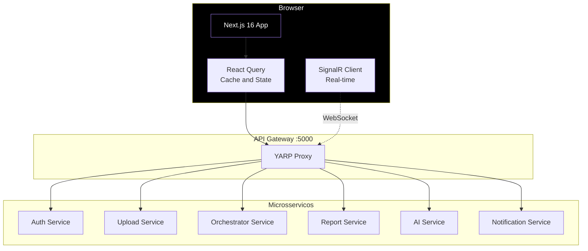
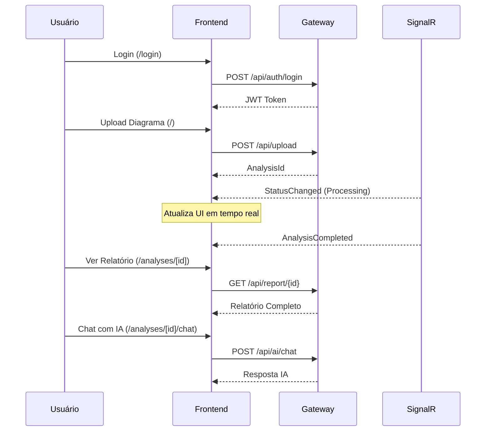
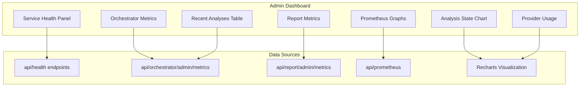
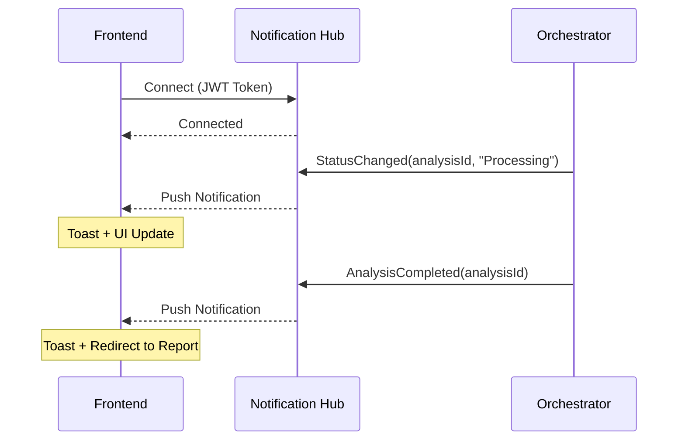

# 🖥️ ArchLens - Frontend

[](https://github.com/archlens-platform/archlens-frontend/actions/workflows/ci.yml)
[](https://sonarcloud.io/summary/new_code?id=archlens-platform_archlens-frontend)
[](https://sonarcloud.io/summary/new_code?id=archlens-platform_archlens-frontend)
[](https://sonarcloud.io/summary/new_code?id=archlens-platform_archlens-frontend)
[](https://sonarcloud.io/summary/new_code?id=archlens-platform_archlens-frontend)
[](https://sonarcloud.io/summary/new_code?id=archlens-platform_archlens-frontend)
[](https://sonarcloud.io/summary/new_code?id=archlens-platform_archlens-frontend)
[](https://sonarcloud.io/summary/new_code?id=archlens-platform_archlens-frontend)

> **Interface Web para Análise Arquitetural de Diagramas**
> Hackathon FIAP - Fase 5 | Pós-Tech Software Architecture + IA para Devs
>
> **Autor:** Rafael Henrique Barbosa Pereira (RM366243)

[](https://nextjs.org/)
[](https://react.dev/)
[](https://www.typescriptlang.org/)
[](https://tailwindcss.com/)
[](https://ui.shadcn.com/)

---

## 📋 Descrição

O **ArchLens Frontend** é a interface web da plataforma ArchLens, construída com **Next.js 16** e **React 19**. Permite upload de diagramas arquiteturais, acompanhamento em tempo real do processamento via **SignalR**, visualização de relatórios de análise e interação com IA para follow-up de dúvidas.

---

## 🏗️ Arquitetura



---

## 🔄 Fluxo do Usuário



---

## 🛠️ Tecnologias

| Tecnologia | Versão | Descrição |
|------------|--------|-----------|
| Next.js | 16 | Framework React SSR/SSG |
| React | 19 | Biblioteca de UI |
| TypeScript | 5.x | Tipagem estática |
| Tailwind CSS | 4 | Utility-first CSS |
| shadcn/ui | - | Componentes acessíveis |
| React Query | 5.x | Server state management |
| SignalR Client | - | WebSocket real-time |
| Recharts | 2.x | Gráficos e dashboards |
| Sonner | - | Notificações toast |
| Axios | 1.x | HTTP client |

---

## 📁 Estrutura do Projeto

```
archlens-frontend/
├── src/
│   ├── app/
│   │   ├── (auth)/
│   │   │   ├── login/page.tsx
│   │   │   └── register/page.tsx
│   │   ├── (main)/
│   │   │   ├── page.tsx                    # Home + Upload
│   │   │   ├── analyses/
│   │   │   │   ├── page.tsx                # Lista de análises
│   │   │   │   └── [id]/
│   │   │   │       ├── page.tsx            # Detalhe + Relatório
│   │   │   │       └── chat/page.tsx       # Chat IA follow-up
│   │   │   ├── compare/page.tsx            # Comparação
│   │   │   └── admin/page.tsx              # Dashboard Admin
│   │   ├── privacy-policy/page.tsx
│   │   └── terms/page.tsx
│   ├── components/
│   │   ├── ui/                             # shadcn/ui components
│   │   ├── layout/                         # Header, Sidebar, Footer
│   │   └── charts/                         # Recharts wrappers
│   ├── providers/
│   │   ├── auth-provider.tsx               # Contexto JWT
│   │   ├── query-provider.tsx              # React Query
│   │   └── signalr-provider.tsx            # SignalR auto-reconnect
│   ├── hooks/
│   │   ├── use-auth.ts
│   │   ├── use-analyses.ts
│   │   └── use-signalr.ts
│   ├── services/
│   │   └── api.ts                          # Axios instance + interceptor
│   └── lib/
│       └── utils.ts
├── public/
├── tailwind.config.ts
├── next.config.ts
├── package.json
└── README.md
```

---

## 📡 Páginas e Rotas

| Rota | Página | Autenticação | Descrição |
|------|--------|--------------|-----------|
| `/` | Home + Upload | ✅ Authenticated | Upload de diagramas |
| `/login` | Login | ❌ Pública | Autenticação de usuário |
| `/register` | Registro | ❌ Pública | Criação de conta |
| `/analyses` | Lista | ✅ Authenticated | Todas as análises do usuário |
| `/analyses/[id]` | Detalhe | ✅ Authenticated | Relatório completo da análise |
| `/analyses/[id]/chat` | Chat IA | ✅ Authenticated | Follow-up com IA sobre a análise |
| `/compare` | Comparação | ✅ Authenticated | Comparar análises lado a lado |
| `/admin` | Dashboard | 🔐 Admin | Painel administrativo |
| `/privacy-policy` | Política Privacidade | ❌ Pública | Política de privacidade |
| `/terms` | Termos de Uso | ❌ Pública | Termos de uso |

---

## 📊 Dashboard Admin

O painel administrativo (`/admin`) oferece visibilidade completa da plataforma:

| Seção | Descrição | Fonte |
|-------|-----------|-------|
| Service Health | Status de cada microsserviço | Health endpoints |
| Orchestrator Metrics | Métricas de processamento | Orchestrator API |
| Report Metrics | Métricas de geração de relatórios | Report API |
| Prometheus Integration | Métricas de infraestrutura | `/api/prometheus` proxy |
| Analyses by State | Distribuição por estado | Orchestrator API |
| Provider Usage | Uso por provider de IA | AI Service |
| Recent Analyses | Últimas análises processadas | Orchestrator API |



---

## 🔄 Real-time com SignalR



### Funcionalidades Real-time

| Evento | Ação no Frontend |
|--------|------------------|
| `StatusChanged` | Atualiza badge de status + toast |
| `AnalysisCompleted` | Toast de sucesso + link para relatório |
| `AnalysisFailed` | Toast de erro + detalhes |
| `ReportGenerated` | Habilita download do relatório |

---

## 🔒 Autenticação

| Componente | Implementação |
|------------|---------------|
| Storage | JWT em `localStorage` |
| Interceptor | Axios request interceptor (header `Authorization: Bearer`) |
| Refresh | Redirect para `/login` ao expirar |
| Protected Routes | Middleware Next.js + AuthProvider |

---

## 🚀 Como Executar

### Pré-requisitos

- Node.js 20+
- npm ou yarn

### Executar Local

```bash
# Instalar dependências
npm install

# Executar em modo desenvolvimento
npm run dev
```

A aplicação estará disponível em: `http://localhost:3000`

---

## 🔧 Variáveis de Ambiente

| Variável | Descrição | Exemplo |
|----------|-----------|---------|
| `NEXT_PUBLIC_API_URL` | URL base da API Gateway | `http://localhost:5000` |
| `NEXT_PUBLIC_WS_URL` | URL do WebSocket (SignalR) | `http://localhost:5000` |

---

## 🐳 Docker

```bash
docker build -t archlens-frontend .
docker run -p 3000:3000 archlens-frontend
```

---

## 🧪 Testes

```bash
# Rodar testes
npm test

# Rodar com coverage
npm run test:coverage
```

---

FIAP - Pós-Tech Software Architecture + IA para Devs | Fase 5 - Hackathon (12SOAT + 6IADT)
